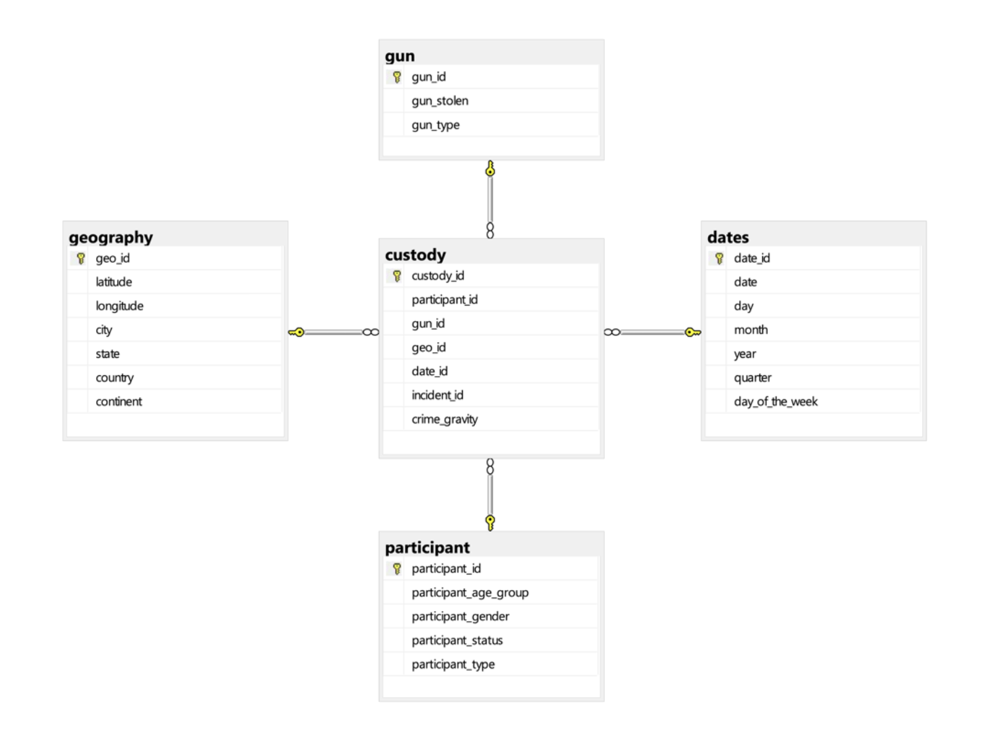

# LDS a.a. 23-24
Decision Support Systems - Module II: LABORATORY OF DATA SCIENCE (2023/24)

The project consists in a set of assignements corresponding to a BI process: data integration, construction of an OLAP cube, qurying of a OPLAP cube and reporting.

# Team memebrs
- [Xinyi Gu](https://github.com/GU-XINYI)
- [Yian Li](https://github.com/Li-Yian)

# Dataset
Gun violence dataset provided by the professors of the [course](http://didawiki.cli.di.unipi.it/doku.php/mds/lbi/lds_2023-2024).
The *Police.csv* contains the main body of data: a table with data about gun violence incidents between January 2013 and March 2018 in the US. The same table also includes information about the victims, the guns, and the locations. 

[dataset](./LDS_Part1_Group_3/dataset/): this directory contains the raw data CSV file, some additional datasets for integrate some detailed information and tables derived from raw data exported into CSV prepared for loading onto the SQL Server Management Studio.
- Raw data: *Police.csv*
- Split tables: *custody.csv* · *participant.csv* · *dates.csv* · *geography.csv* · *gun.csv*
- External data: *city_country_continent.csv* · *uscities.csv*

External data source: 
- https://simplemaps.com/data/us-cities
- https://gitcode.com/mirrors/wizardcode/world-area/tree/master/children

# Tasks
- [ETL and Data Warehouse building](./LDS_Part1_Group_3): create and populate a database starting from different files **without** using `pandas`. Here are some brief explanations of the scripts in the [code](./LDS_Part1_Group_3/code) directory.
  - *data_prep.py*: used for data understanding and preparation tasks
  - *load.py*: executed to load the processed data into the server
  - *myfunctions.py*: self-defined some reusable functions
- [SQL Server Integration Services (SSIS)](./LDS_Part2_Group_3) practice with computation on the client side
- [Data Cube](./LDS_Part3_Group_3/Group_3) building (SSAS) and [business questions answering](./LDS_Part3_Group_3/LDS_part3.mdx) by querying the cube using MDX in SQL Management Studio.
- [Reporting](./LDS_Part3_Group_3/visualization_bi.pbix): use PowerBI to visualize interesting points w.r.t. the data available in the cube.
